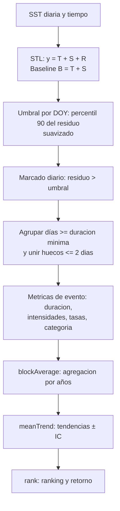

# Detección de Olas de Calor Marinas (MHWs) con Climatología STL

**Documentación del script `STL_MarineHeatwaves.py`**

*Autor: Daniel Camarena*

---

## Resumen

Este reporte documenta un algoritmo para detectar olas de calor marinas (MHWs) a partir de series diarias de temperatura superficial del mar (SST). La novedad radica en el uso de una climatología *no estacionaria* obtenida mediante descomposición *STL* (tendencia + ciclo estacional) como línea base dinámica, sobre la cual se calculan residuos y umbrales percentilares dependientes del día del año (DOY). El método implementa la definición consensuada de MHWs (Hobday et al., 2016) con modificaciones en la climatología (Bonino et al., 2023): un evento es un periodo de al menos cinco días consecutivos en que la SST excede un umbral (percentil 90 del residuo por DOY, suavizado). Se describen las funciones principales del script `STL_MarineHeatwaves.py`, sus entradas y salidas, así como las fórmulas matemáticas para cálculo de duración, intensidades (media, máxima y acumulada), tasas de inicio/declive y categorías de severidad. Se incluyen ejemplos reproducibles en Python para validar el funcionamiento, junto con agregaciones por bloques, tendencias e indicadores de retorno.

---

## Introducción

Las olas de calor marinas (MHWs) son episodios de SST inusualmente alta y persistente que alteran procesos físicos y ecosistemas. La definición operativa (Hobday et al., 2016) requiere umbrales extremos relativos a una climatología y una duración mínima. En contextos de calentamiento y variación estacional cambiante, emplear una climatología estacionaria puede sesgar la detección. Por ello, se adopta una climatología *dinámica* mediante descomposición *STL* (Seasonal–Trend decomposition using LOESS), que separa tendencia $T_t$ y estacionalidad $S_t$ de la señal $y_t$.

---

## Fundamento matemático

Sea $y_t$ la SST diaria en el día $t$. La descomposición STL plantea:

$$
y_t = T_t + S_t + R_t, 
$$

$$
B_t = T_t + S_t, \quad\text{(baseline)}
$$

$$
R_t = y_t - B_t, \quad\text{(residuo)}
$$

donde $B_t$ es la climatología dependiente del tiempo. Para cada día del año $d\in\{1,\dots,365\}$ se estima el umbral percentilar del residuo:

$$
\theta_d \;=\; P_{90}\!\left(R_t \,\middle|\, \mathrm{DOY}=d\right),
$$

el cual se suaviza en $d$ con una ventana centrada. Definimos $\theta_t := \theta_{\mathrm{DOY}(t)}$.

Un día es etiquetado como cálido si $R_t > \theta_t$. Un **evento MHW** es una secuencia de días cálidos con duración

$$
D = t_{\mathrm{end}} - t_{\mathrm{start}} + 1 \quad \text{tal que} \quad D \ge d_{\min}=5,
$$

uniéndose dos secuencias separadas por un hueco $\le 2$ días.

Para cada evento se calculan:

$$
I_{\max} = \max_{t\in \text{evento}} (y_t - B_t),
$$

$$
I_{\mathrm{mean}} = \frac{1}{D}\sum_{t\in \text{evento}} (y_t - B_t),
$$

$$
I_{\mathrm{cum}} = \sum_{t\in \text{evento}} (y_t - B_t).
$$

Las **tasas** (aprox. lineales) de inicio y declive se estiman como

$$
r_{\mathrm{onset}} = \frac{I_{\max} - I_{\mathrm{start}}}{t_{\mathrm{peak}}-t_{\mathrm{start}}},\qquad
r_{\mathrm{decline}} = \frac{I_{\max} - I_{\mathrm{end}}}{t_{\mathrm{end}}-t_{\mathrm{peak}}}.
$$

La **categoría** (1–4) sigue umbrales por múltiplos de la excedencia de Hobday et al. (2018).

---

## Arquitectura del algoritmo



---

## Descripción detallada de funciones

### `detect_stl(t, temp, ...)`: entradas

| Parámetro | Tipo / Unidad | Significado |
|-----------|---------------|-------------|
| `t` | datetime o ordinal | Fechas diarias de la serie. |
| `temp` | °C | SST diaria. |
| `pctile` | % (def. 90) | Percentil del residuo por DOY para el umbral. |
| `minDuration` | días (def. 5) | Duración mínima del evento. |
| `joinAcrossGaps` | bool | Unir secuencias separadas por huecos cortos. |
| `maxGap` | días (def. 2) | Máximo hueco permitido entre secuencias. |
| `windowHalfWidth` | días | Ventana $\pm W$ para estimar $P_{90}$ por DOY. |
| `smoothPercentile` | bool | Suavizar el percentil a lo largo de DOY. |
| `smoothPercentileWidth` | días | Ancho de suavizado del percentil DOY. |
| `maxPadLength` | días/False | Interpolación de NaNs hasta una longitud límite. |
| `Ly` | bool | Calendario no gregoriano (p. ej. 360 días). |

### `detect_stl`: salidas `mhw` (por evento)

| Clave | Descripción (tipo / unidad) |
|-------|----------------------------|
| `n_events` | Número total de eventos detectados (int). |
| `time_start`, `time_end`, `time_peak` | Fechas en ordinal (int). |
| `date_start`, `date_end`, `date_peak` | Fechas calendario (datetime). |
| `index_start`, `index_end`, `index_peak` | Índices en la serie (int). |
| `duration` | Duración del evento (días). |
| `intensity_max`, `intensity_mean` | Intensidad máxima y media $(y_t-B_t)$ (°C). |
| `intensity_cumulative`, `intensity_var` | Intensidad acumulada (°C·día) y varianza (°C). |
| `intensity_max_relThresh`, `intensity_mean_relThresh`, `intensity_cumulative_relThresh` | Métricas respecto al umbral. |
| `intensity_max_abs` | Temperatura absoluta máxima durante el evento (°C). |
| `rate_onset`, `rate_decline` | Tasas media de inicio/declive (°C/día). |
| `category` | Severidad: *Moderate, Strong, Severe, Extreme*. |
| `duration_moderate` ... `duration_extreme` | Días por categoría (días). |

### `detect_stl`: salidas `clim` (por día)

| Clave | Descripción |
|-------|-------------|
| `seas` | Baseline $B_t = T_t + S_t$ (STL), alineado a la serie. |
| `thresh` | $\theta_t$: percentil 90 del residuo por DOY (suavizado). |
| `missing` | Máscara booleana de datos faltantes. |

### Pseudocódigo de `detect_stl`

1. Imputar huecos cortos (`pad`) si aplica.
2. Calcular STL $\Rightarrow$ obtener $T_t$, $S_t$, baseline $B_t$ y residuo $R_t$.
3. Para cada DOY, estimar $P_{90}(R|\mathrm{DOY})$ y suavizar $\Rightarrow \theta_t$.
4. Marcar días con $R_t > \theta_t$.
5. Agrupar secuencias de días marcados; unir si la separación $\le \text{maxGap}$.
6. Para cada evento: fechas, duración, intensidades, tasas y categoría.

### `blockAverage(t, mhw, clim=None, temp=None, ...)`

Agrega métricas por bloques de longitud $L$ (p. ej. anual). Salida típica: `count`, `duration`, `intensity_mean`, `intensity_max`, `total_days`, `total_icum`. Si se pasan `clim` y `temp`, agrega días por categoría (*moderate*, *strong*, *severe*, *extreme*).

### `meanTrend(mhwBlock, alpha=0.05)`

Ajusta tendencias lineales $y = \beta_0 + \beta_1 t$ por métrica agregada y devuelve: medias, pendientes y semianchos del IC del 95% (`mean`, `trend`, `dtrend`).

### `rank(t, mhw)`

Devuelve ranking y periodo de retorno (RP) aproximado por evento y métrica; típicamente $\mathrm{RP} \approx (N_{\text{años}}+1)/\text{rango}$.

### `runavg(ts,w)` y `pad(data, maxPadLength)`

`runavg` aplica media móvil *periódica* (evita bordes replicando la serie). `pad` interpola linealmente tramos de NaNs cuya longitud no excede `maxPadLength`.

---

## Ejemplos reproducibles (Python)

### Ejemplo 1: serie sintética y detección `detect_stl`

```python
import numpy as np
from datetime import date, datetime
import importlib.util, sys

# Cargar el módulo STL_MarineHeatwaves.py
spec = importlib.util.spec_from_file_location("stl_mhw", "STL_MarineHeatwaves.py")
stl_mhw = importlib.util.module_from_spec(spec); sys.modules["stl_mhw"] = stl_mhw
spec.loader.exec_module(stl_mhw)

# Serie sintética de 5 años (ignorar bisiestos)
start = date(2000,1,1); days = 5*365
t_ord = np.array([start.toordinal()+i for i in range(days)])
t = np.arange(days)

# 20°C + ciclo anual + tendencia + ruido
sst = 20 + 2.5*np.sin(2*np.pi*t/365) + 0.02*(t/365.0) + np.random.normal(0,0.3,days)

# Inyectar un pulso cálido de 10 días (≈marzo 2002)
evt = 2*365 + 60
sst[evt:evt+10] += 2.0

# Detección con STL: P90, minDuration=5, unir huecos de hasta 2 días
mhw, clim = stl_mhw.detect_stl(
    t_ord, sst, pctile=90, minDuration=5, joinAcrossGaps=True, maxGap=2
)

print("Eventos:", mhw["n_events"])
for i in range(mhw["n_events"]):
    print(i, mhw["date_start"][i], mhw["date_end"][i], 
          "Días:", int(mhw["duration"][i]),
          "Imax:", float(mhw["intensity_max"][i]),
          "Imean:", float(mhw["intensity_mean"][i]),
          "Cat:", mhw["category"][i])
```

**Resultado esperado:** 1 evento de ≈10 días, con intensidad media ≈1.8°C e intensidad máxima ≈2.3°C, categorizado como *Severe*. Las fechas `date_start`/`date_end` y las tasas `rate_onset`/`rate_decline` reflejan el pulso inyectado.

### Ejemplo 2: agregación anual, tendencias y retorno

```python
# Agregación anual
mhw_block = stl_mhw.blockAverage(t_ord, mhw, clim=clim, temp=sst)

print("Años:", mhw_block["years_start"], "->", mhw_block["years_end"])
print("Conteo anual:", mhw_block["count"])
print("Duración media:", mhw_block["duration"])
print("Imax media:", mhw_block["intensity_max"])

# Tendencias lineales (±IC 95%)
mean, trend, dtrend = stl_mhw.meanTrend(mhw_block, alpha=0.05)
for k in ["count","duration","intensity_max","intensity_mean","total_days"]:
    print(k, "media=", mean[k], "trend/yr=", trend[k], "±", dtrend[k])

# Ranking y periodo de retorno por evento
rk, rp = stl_mhw.rank(t_ord, mhw)
print("Rank Imax:", rk.get("intensity_max", []))
print("RP Imax (años):", rp.get("intensity_max", []))
```

---

## Buenas prácticas de validación

- Verificar sensibilidad de resultados ante `pctile`, `minDuration` y `maxGap`.
- Comprobar estabilidad del percentil DOY con ventanas y suavizado.
- Usar datos con control de calidad y documentar la imputación (`pad`).

---

## Conclusiones

El uso de una climatología STL aporta coherencia en contextos de calentamiento y variabilidad estacional. La combinación *STL + percentil DOY + reglas de duración/unión* produce detecciones robustas y comparables, con métricas ricas (intensidades, tasas, categorías) y herramientas de síntesis (agregación, tendencias, retorno) útiles para diagnóstico físico y ecológico.

---

## Referencias

1. Hobday, A. J., Alexander, L. V., Perkins, S. E., *et al.* (2016). A hierarchical approach to defining marine heatwaves. *Prog. Oceanogr.*, 141, 227–238.

2. Hobday, A. J., Oliver, E. C. J., Sen Gupta, A., *et al.* (2018). Categorizing and naming marine heatwaves. *Oceanography*, 31(2), 162–173.

3. Bonino, G., Masina, S., Galimberti, G., Moretti, M. (2023). Southern Europe and Western Asia Marine Heatwaves (SEWA-MHWs): a dataset based on macroevents. *Earth Syst. Sci. Data*, 15, 1269–1285.

---

## Apéndice: código Python completo de los ejemplos

```python
import numpy as np
from datetime import date
import importlib.util, sys

spec = importlib.util.spec_from_file_location("stl_mhw", "STL_MarineHeatwaves.py")
stl_mhw = importlib.util.module_from_spec(spec); sys.modules["stl_mhw"]=stl_mhw
spec.loader.exec_module(stl_mhw)

start = date(2000,1,1); days=5*365
t_ord = np.array([start.toordinal()+i for i in range(days)])
t = np.arange(days)
sst = 20 + 2.5*np.sin(2*np.pi*t/365) + 0.02*(t/365.0) + np.random.normal(0,0.3,days)
sst[2*365+60:2*365+70]+=2.0

mhw, clim = stl_mhw.detect_stl(t_ord, sst, pctile=90, minDuration=5, joinAcrossGaps=True, maxGap=2)
print("Eventos:", mhw["n_events"])

mhw_block = stl_mhw.blockAverage(t_ord, mhw, clim=clim, temp=sst)
mean, trend, dtrend = stl_mhw.meanTrend(mhw_block, alpha=0.05)
rk, rp = stl_mhw.rank(t_ord, mhw)
```
